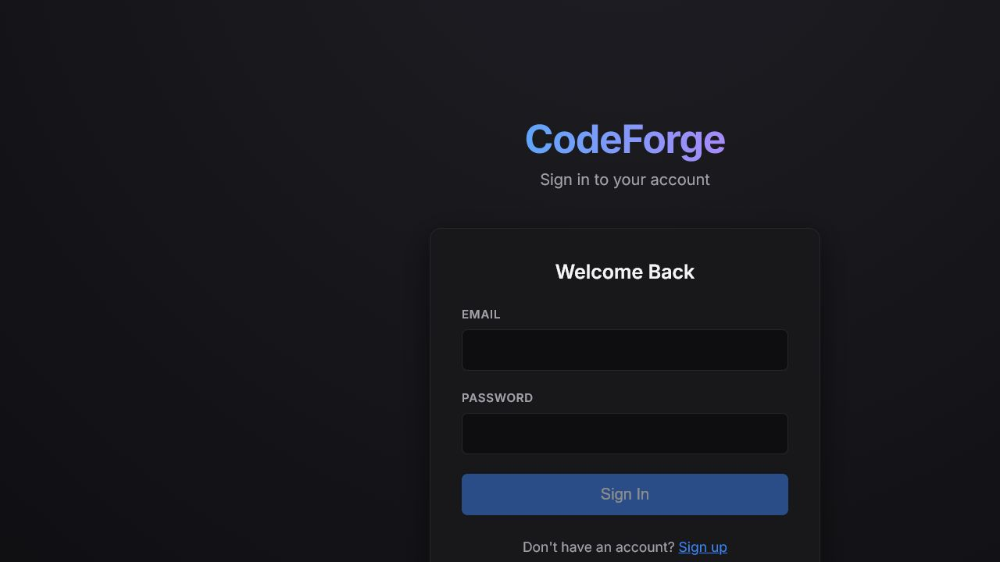
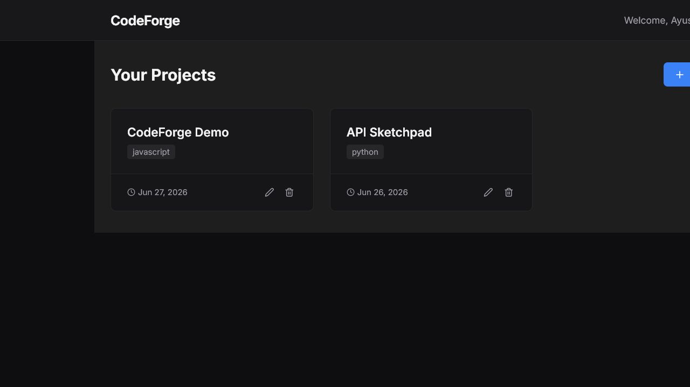
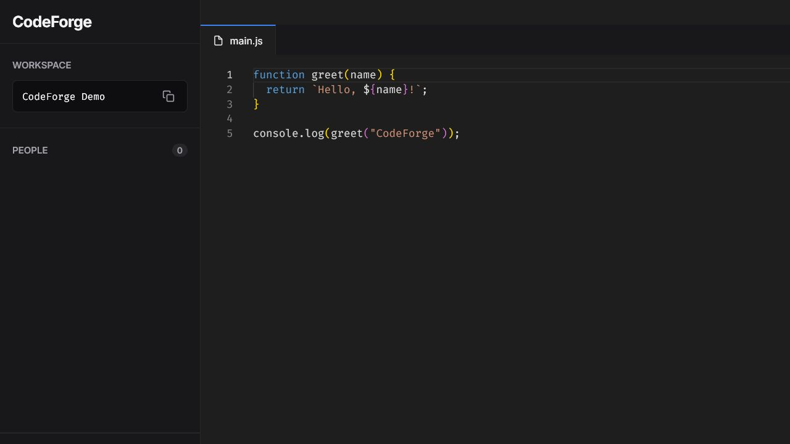

# CodeForge Application

CodeForge is a dynamic, real-time collaborative code editor built using the MERN stack (MongoDB, Express, React, Node.js). The application allows users to join collaborative coding sessions from anywhere in the world, enabling live coding with real-time collaboration. Users can join a coding room using a unique room ID, edit or write code, and the app will display "User is Typing" as they type. The editor supports multiple programming languages such as Python, C++, Java, and JavaScript. When a user selects a language from the dropdown, the app automatically configures the environment accordingly, ensuring that the right syntax highlighting, formatting, and features are available for that specific language. This dynamic setup makes it easy for users to collaborate across various programming languages in a seamless manner. Whether you're working on Python scripts, Java applications, or C++ projects, the CodeForge adapts to provide a tailored coding experience.

## Features

- **Real-time collaboration**: Multiple users can join a shared room via unique session ID with sub-100ms sync latency and live typing indicators.
- **User presence**: Shows the users currently in the room and indicates when someone is typing.
- **Multi-Language Support**: JavaScript, Python, Java, and C++ with automatic syntax highlighting and environment configuration per language.
- **Responsive UI**: Consistent experience across desktop and mobile.
- **Live Project**: Access the live project online.

## Live Demo

You can access the live demo of the project at:  
[CodeForge Live Project](https://CodeForge.onrender.com/)

## Screenshot Of Application







*Example of the real-time code editing interface.*

## Technologies Used

- **Frontend**: React, Monaco Editor (for the code editor), Socket.io (for real-time communication)
- **Backend**: Node.js, Express.js, Socket.io (for real-time communication)
- **Database**: MongoDB (if used for user authentication or saving sessions)

## Installation

### Prerequisites
Ensure you have the following installed on your system:
- **Node.js** (https://nodejs.org/)
- **npm** (comes with Node.js)

### Clone the Repository

```bash
git clone https://github.com/your-username/CodeForge.git
cd CodeForge
